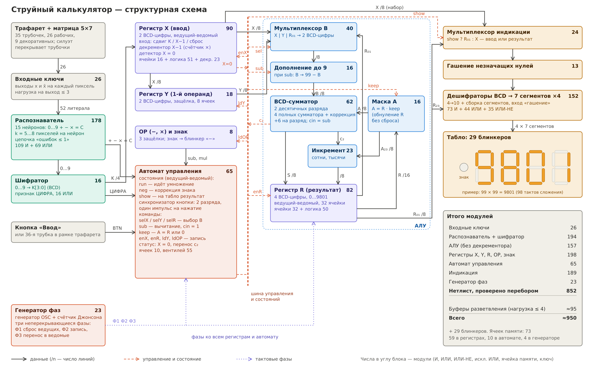
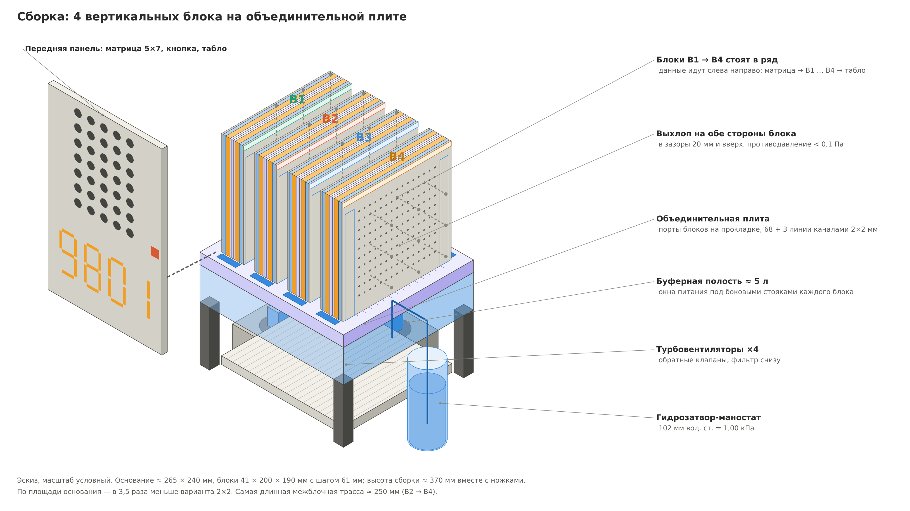

# FluidicPC

Вычислительные устройства на элементах струйной логики: от моделей отдельных элементов и расчёта течения до синтеза схем и разводки плат.

## Проекты и инструменты

| Папка | Что внутри |
|---|---|
| [`calculator/`](calculator) | **Струйный калькулятор** — арт-объект на 852 элементах: распознаёт символ с матрицы трубочек 5 × 7, считает и показывает результат на семисегментных индикаторах. Модель, структурный и высокоуровневый Verilog, расчёты питания и конструктива |
| [`adder/`](adder) | 4-разрядный сумматор: Verilog, синтез в библиотеку струйных элементов (`fluidic.lib`), тестбенч |
| [`elements/`](elements) | 3D-модели элементов «Волга» (СТ41, СТ42, СТ43, СТ55, СТ56, СТ59, СТ60, СТ63 и др.) во FreeCAD |
| [`bench/`](bench) | расчёт течения в элементе СТ41 в OpenFOAM: подготовка сетки и запуск на кластере |
| [`sch/`](sch) | схемы и плата сумматора в KiCad |
| [`verilog2netlist/`](verilog2netlist) | конвертер синтезированного Verilog в netlist и плату KiCad |

## Струйный калькулятор

Ввод — трафарет на матрице трубочек и кнопка «Ввод». Операнды от 0 до 99, операции `+ − ×`. Схема разложена на 8 даёв по 150 элементов. Даи попарно собраны в 4 вертикальных блока, блоки стоят на объединительной плите с буферной полостью питания.

Подробнее — в [`calculator/README.md`](calculator/README.md).

## Лицензия

[LICENSE](LICENSE)
