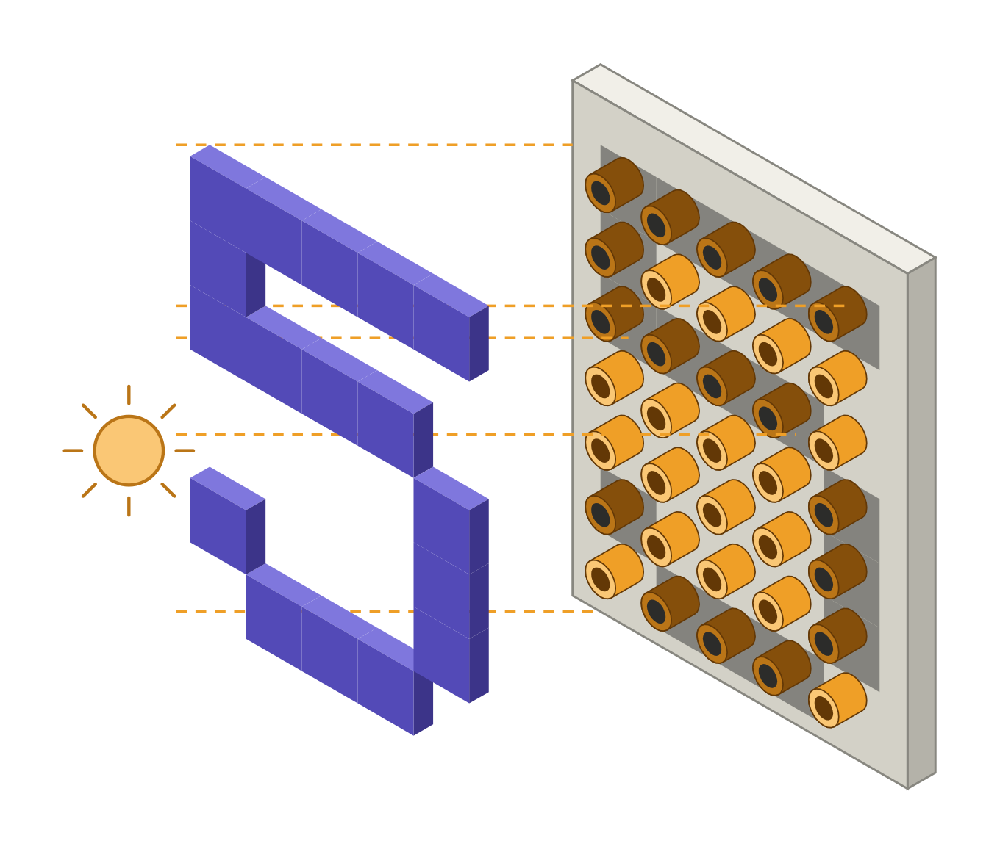
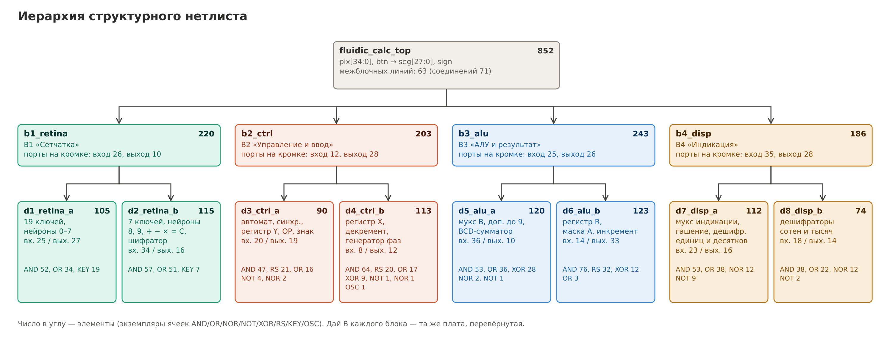

# Струйный калькулятор

Вычислительное устройство на элементах струйной логики (прилипание ламинарной струи к стенке), задуманное как арт-объект. Символ задаётся трафаретом: силуэт перекрывает часть трубочек матрицы 5 × 7. Машина распознаёт символ, считает в двоично-десятичном коде и показывает результат на четырёх семисегментных индикаторах из блинкеров. Умножение выполняется повторным сложением по одному такту, поэтому сумма на табло растёт на глазах, как у арифмометра.



| Параметр | Значение |
|---|---|
| Ввод | матрица 5 × 7 трубочек (26 рабочих) и кнопка «Ввод» |
| Символы | `0–9 + − × = C`; одна ошибка пикселя не мешает распознаванию |
| Операнды и результат | 0…99, результат −99…9801 |
| Вывод | 4 семисегментных индикатора и блинкер «−» (29 блинкеров) |
| Логика | 852 элемента: 2И, 2ИЛИ, 2ИЛИ-НЕ, НЕ, 2искл.ИЛИ, RS-ячейка, ключ, генератор |
| Конструктив | 8 даёв 15 × 10 мест → 4 вертикальных блока по 2 дая → объединительная плита |
| Питание | ≈ 1 кПа, ≈ 500 л/мин, Re сопла ≈ 1150 |
| Такт | 3 фазы, ≈ 3 Гц; 99 × 99 считается ≈ 35 с |

## Документация

| Раздел | Что внутри |
|---|---|
| [Архитектура](docs/architecture.md) | распознаватель, регистры, порядок работы, АЛУ, тактирование, подсчёт элементов, быстродействие, допущения |
| [Конструктив](docs/construction.md) | место элемента, дай, вертикальный блок, разбиение по даям и блокам, объединительная плита |
| [Питание](docs/power.md) | режим сопла, расход, источник, полости, стояки, выхлоп, бюджет давления |


## Структура папки

| Папка | Содержимое |
|---|---|
| [`model/`](model) | эталонная модель на Python: вентильный нетлист, симулятор, тесты, генераторы Verilog. Источник правды для всего остального |
| [`netlist/`](netlist) | структурный Verilog для разводки: 8 даёв, 4 блока, верхний уровень, библиотека ячеек, тестбенчи. **Генерируется** из `model/`, руками не править |
| [`rtl/`](rtl) | высокоуровневая (поведенческая) модель на Verilog и её тестбенч |
| [`calc/`](calc) | отдельные расчёты: подбор весов распознавателя, пневматика, разбиение по даям |
| [`docs/`](docs) | описание проекта; картинки в `docs/images/`, скрипты, которые их рисуют, — в `docs/src/` |
| [`ci/`](ci) | обвязка шагов CI |

## Две версии на Verilog

**Структурный нетлист** (`netlist/`) — то, что идёт в разводку. Каждый экземпляр ячейки — один физический элемент на плате. Иерархия повторяет конструктив: модуль дая, модуль блока из двух даёв, верхний уровень с линиями объединительной платы.



| Порт верхнего уровня | Назначение |
|---|---|
| `pix[34:0]` | трубочки матрицы, `pix[r*5 + c]`: r = 0…6 строка сверху, c = 0…4 столбец слева; 1 — трубочка закрыта |
| `btn` | кнопка «Ввод» |
| `seg[27:0]` | сегменты, `seg[7*k + j]`: k = 0 единицы … 3 тысячи; j = 0…6 сегменты a…g |
| `sign` | блинкер «−» |

Библиотека ячеек [`netlist/cells/fluidic_cells.v`](netlist/cells/fluidic_cells.v) с макросом `SYNTHESIS` превращает элементы в чёрные ящики, и иерархия даёв и блоков сохраняется при синтезе. Без макроса это поведенческие модели с задержкой элемента. Для yosys есть Liberty-описание [`netlist/cells/fluidic_calc.lib`](netlist/cells/fluidic_calc.lib).

**Высокоуровневая модель** ([`rtl/fluidic_calc_rtl.v`](rtl/fluidic_calc_rtl.v)) описывает те же регистры, события и уравнения арифметикой, без вентилей. Один фронт `clk` в ней соответствует одному такту машины. Она служит эталоном: тестбенч `netlist/tb_cosim.v` гоняет её одновременно с нетлистом и сверяет табло после каждого такта.

## Как проверить

Нужны `python3`, `iverilog` и `yosys`.

```sh
cd calculator
make model     # тесты Python-модели, структурная проверка нетлиста, сверка с RTL-зеркалом
make rtl       # тестбенч высокоуровневой модели
make netlist   # тестбенч структурного нетлиста с настоящим генератором фаз
make cosim     # нетлист и высокоуровневая модель такт в такт
make stat      # подсчёт элементов по даям и блокам
make regen     # перегенерировать нетлист и тестбенчи из модели
```

Все шаги запускает CI ([`.github/workflows/calculator.yml`](../.github/workflows/calculator.yml)). Он же проверяет, что закоммиченный нетлист совпадает с тем, что генерирует модель.

Полный перебор всех примеров `a op b` для a, b = 0…99 и `+ − ×` (30 000 штук) запускается отдельно, `python3 model/test_model.py full`, и идёт около часа. На текущей модели он проходит без ошибок.

## Перенос в KiCad

Нетлист даёв можно передать конвертеру [`verilog2netlist`](../verilog2netlist). В [`config.py`](../verilog2netlist/config.py) для даёв описаны правила только для NOR, OR и NOT: это элемент `FA:NOR`, ИЛИ снимается с вывода 6, ИЛИ-НЕ — с вывода 7. Для AND, XOR, RS-ячейки, ключа трубочки и генератора символов и футпринтов пока нет. Без правила элемент в netlist не попадает, поэтому правила нужно дописать, когда появятся библиотеки.

## Что ещё не сделано

- Буферы разветвления (≈ 95 при нагрузке на выход до 4) в нетлист не вставлены. Их удобнее добавлять при разводке, когда известны коэффициент разветвления и длины каналов.
- Сброса по включению нет: после подачи давления машина может минуту досчитывать случайное «умножение».
- Задержка элемента (1,5 мс), расход входа управления и допустимая нагрузка на выход — оценки. Их нужно измерить на реальных элементах. Что от них зависит — в разделе «Допущения» [архитектуры](docs/architecture.md#допущения).
