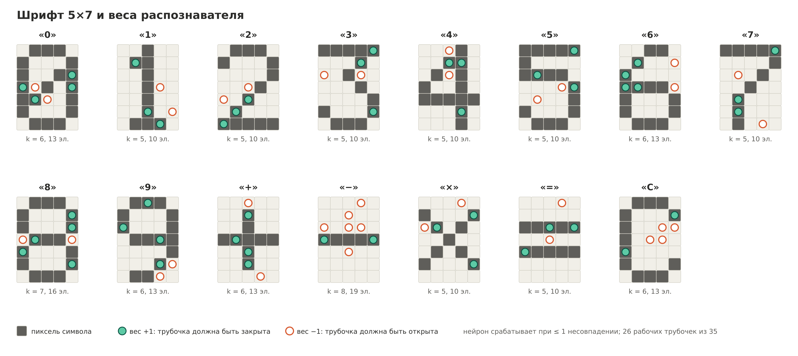
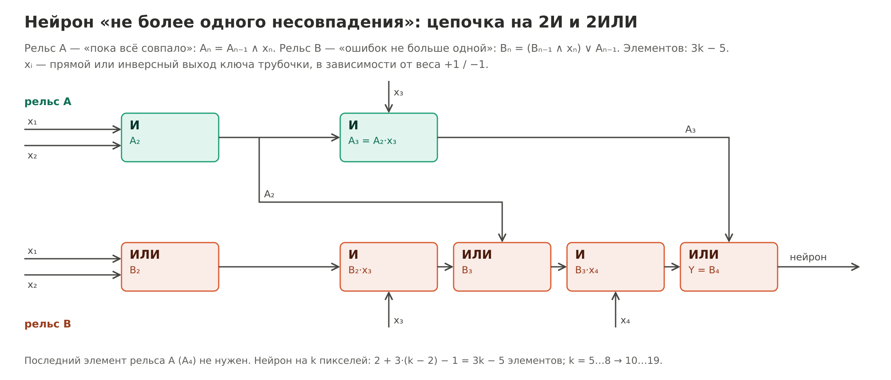
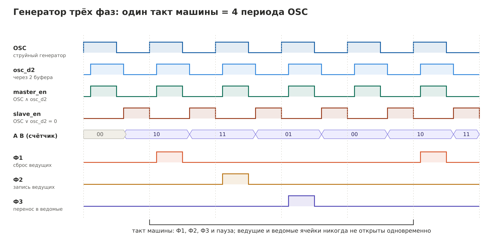

# Архитектура калькулятора

## Ввод и распознавание

Символ задаётся трафаретом: силуэт перекрывает часть трубочек матрицы 5 × 7, и ключ каждой трубочки выдаёт прямой и инверсный сигнал. Распознаются 15 символов: `0–9 + − × = C`.

Каждый символ распознаёт свой нейрон с троичными весами: +1 — трубочка должна быть закрыта, −1 — открыта, 0 — нейрон на неё не смотрит. Нейрон срабатывает, если среди его пикселей не совпал с образцом **максимум один**. Веса подобраны перебором ([`calc/recognizer_weights.py`](../calc/recognizer_weights.py)):

- любой другой символ отличается от своего образца минимум в 3 пикселях из набора нейрона, поэтому одна ошибка пикселя не вызывает ни пропуска, ни ложного срабатывания;
- пустая и полностью закрытая матрица не будят ни один нейрон;
- используются 26 трубочек из 35, нагрузка на выход ключа не больше 3.

«Не более одного несовпадения» — это цепочка из двух рельсов на 2И/2ИЛИ, 3k − 5 элементов на нейрон из k пикселей:

Шифратор собирает 10 выходов цифр в BCD-код K[3:0] и признак «цифра» — 16 элементов ИЛИ.

## Регистры и порядок работы

| Регистр | Разрядность | Тип | Назначение |
|---|---|---|---|
| X | 2 BCD-цифры | ведущий-ведомый | набираемое число; счётчик при умножении |
| Y | 2 BCD-цифры | защёлка | первый операнд |
| R | 4 BCD-цифры | ведущий-ведомый | результат, аккумулятор |
| OP | 2 бита | защёлка | отложенная операция: вычитание, умножение |
| знак | 1 бит | защёлка | блинкер «−» |
| run, neg, show | 3 бита | ведущий-ведомый | состояния автомата |
| синхронизатор | 2 бита | ведущий-ведомый | один импульс на нажатие кнопки |

| Нажатие | Действие |
|---|---|
| цифра | X ← X·10 + цифра (две последние). После показа результата начинает новый пример |
| `+ − ×` | Y ← X, OP ← операция, R ← X (для `×` R ← 0), X ← 0 |
| `=` при `+` | R ← R + X — 1 такт |
| `=` при `−` | R ← R + (99 − X) + 1; если переноса нет (результат отрицательный) — ещё такт: R ← (99 − R) + 1, знак ← 1 |
| `=` при `×` | пока X ≠ 0: R ← R + Y, X ← X − 1 — по такту на сложение, табло показывает растущую сумму |
| `C` | сброс X, R, OP и знака |

Во время умножения и коррекции знака кнопки игнорируются. `+ − × =` после показа результата тоже игнорируются: новый пример начинается с цифры или `C`.

АЛУ — двухразрядный BCD-сумматор (4 полных сумматора и коррекция +6 на разряд), перед ним мультиплексор операнда B (X, Y или R₀₁) и дополнение до 9 при вычитании; сотни и тысячи только инкрементируются переносом. Индикация показывает X при наборе и R после `=`, незначащие нули гасятся.

## Тактирование

Данные в схеме идут без инверсии, поэтому ведущая ячейка пишется в два шага, а перенос в ведомую идёт по обоим выходам ведущей — без провала в ноль, табло не мигает на каждом такте:

| Фаза | Действие |
|---|---|
| Ф1 | сброс ведущих ячеек регистров с разрешённой записью: `R = Ф1·en` |
| Ф2 | установка ведущих по данным: `S = D·Ф2·en` |
| Ф3 | перенос в ведомые: `S = M·Ф3`, `R = M̄·Ф3` |

Фазы даёт генератор на дае D4: струйный генератор OSC, два буфера задержки, разрешения ведущих и ведомых ячеек без перекрытия и двухразрядный счётчик Джонсона. Такт машины — 4 периода OSC.

## Элементы

| Узел | Элементов |
|---|---|
| Входные ключи | 26 |
| Распознаватель (15 нейронов) | 178 |
| Шифратор | 16 |
| Мультиплексор B | 40 |
| Дополнение до 9 | 16 |
| Маска A | 16 |
| BCD-сумматор, 2 разряда | 62 |
| Инкремент сотен и тысяч | 23 |
| Регистр X (16 ячеек + 51) + декремент и X = 0 (23) | 90 |
| Регистр R (32 ячейки + 50) | 82 |
| Регистр Y (8 ячеек + 10) | 18 |
| OP и знак (3 ячейки + 5) | 8 |
| Автомат управления (10 ячеек + 55) | 65 |
| Мультиплексор индикации | 24 |
| Гашение незначащих нулей | 13 |
| Дешифраторы 7-сегм. ×4 | 152 |
| Генератор фаз (OSC + 4 ячейки + 18) | 23 |
| **Итого** | **852** |

По ячейкам: AND 440, OR 217, NOR 29, NOT 17, XOR 49, RS 73, KEY 26, OSC 1. Буферы разветвления (≈ 95 при нагрузке на выход до 4) в нетлист не вставлены — это физическая доработка под реальный коэффициент разветвления элементов.

## Быстродействие

Самый длинный комбинационный путь — 50 элементов. При ≈ 1,5 мс на элемент вместе с каналом фаза должна длиться 80–100 мс, такт — 0,3–0,4 с (≈ 3 Гц). Сложение и вычитание занимают 1–2 такта, умножение 99 × 99 — 98 тактов, около 35 с. Время на элемент — оценка, его нужно измерить.

## Допущения

| Допущение | Что будет, если неверно |
|---|---|
| Ячейка памяти даёт Q и Q̄ | +51 инвертор |
| Нагрузка на выход — до 4 входов | при 3 — ≈ +95 буферов, бюджет 1000 превышен |
| Расход входа управления 0,1–0,2 л/мин | каналы плиты и соединительного пакета должны быть шире |
| ≈ 1,5 мс на элемент | такт медленнее или быстрее |
| Сброса по включению нет | после включения машина может досчитать «умножение» до 35 с |
