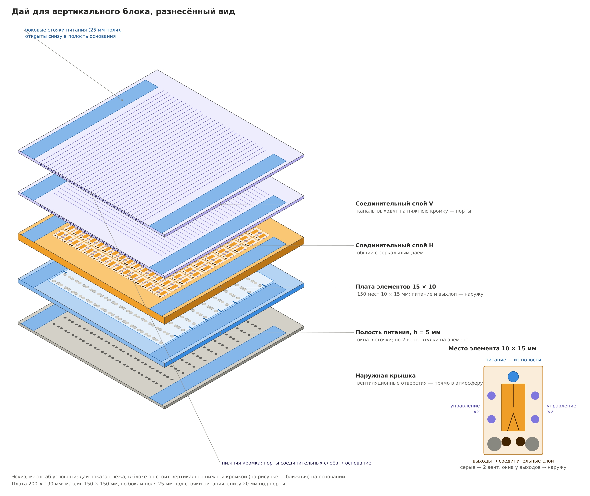
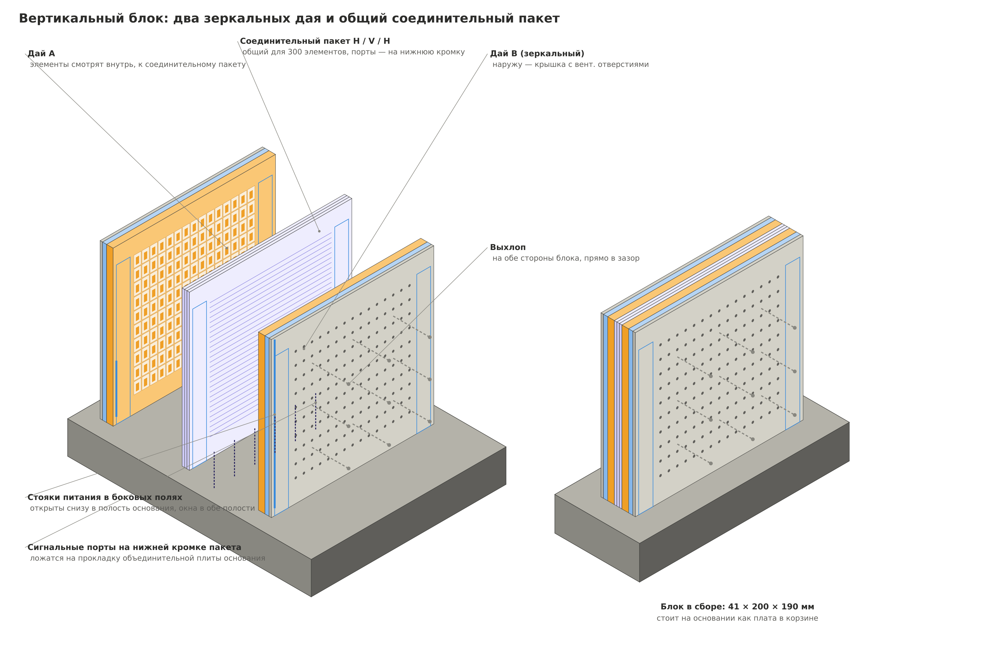
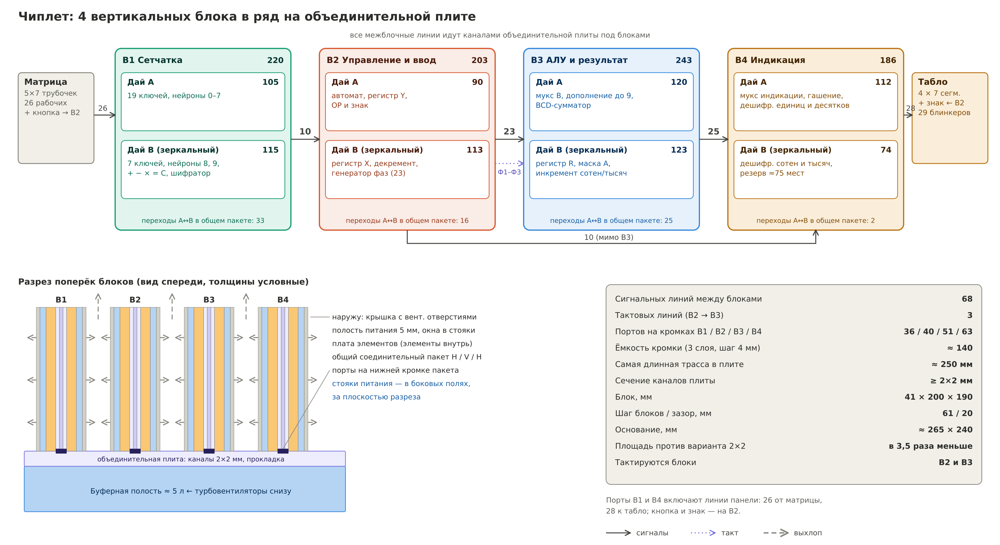

# Конструктив: дай → блок → объединительная плита

Метрики разбиения считает [`calc/partition.py`](../calc/partition.py), само разбиение лежит в [`model/partition.json`](../model/partition.json).

## Место элемента и дай

Место элемента — **10 × 15 мм**: сам элемент, прямой и инверсный выходы, по два входа управления с каждой стороны, два вентиляционных окна у выходов. Плата — **15 × 10 мест**, массив 150 × 150 мм. По бокам поля по 25 мм под стояки питания, снизу 20 мм под порты, сверху 20 мм: плата ≈ 200 × 190 мм.

| Слой (изнутри наружу) | Толщина | Назначение |
|---|---|---|
| Соединительные слои H / V / H | по ≈ 3 мм | общие с зеркальным даем; каналы выходят на нижнюю кромку |
| Плата элементов | ≈ 8 мм | элементы смотрят внутрь, выходы и управление — в соединительный пакет |
| Полость питания | 5 мм | общая для 150 элементов; окна в боковые стояки; сквозь неё проходят по 2 вентиляционные втулки на элемент |
| Наружная крышка | 3 мм | вентиляционные отверстия прямо в атмосферу |

Отдельный слой выхлопа не нужен: каждое вентиляционное окно выведено своей втулкой сквозь полость питания и крышку наружу.

## Блок: два зеркальных дая

Даи A и B — одна и та же плата, B переворачивается. Между ними общий соединительный пакет, поэтому 300 мест блока соединяются без трубок. Блок в сборе ≈ **41 × 200 × 190 мм** (3 + 5 + 8 + 9 + 8 + 5 + 3) и **стоит вертикально**, как плата в корзине:

- нижняя кромка соединительного пакета с портами ложится на прокладку объединительной плиты — подключение одним прижимом;
- обе наружные стороны блока — крышки с вентиляционными отверстиями, выхлоп уходит в зазоры между блоками;
- в боковых полях проходят вертикальные стояки питания, открытые снизу в буферную полость основания.

## Разбиение схемы

Нетлист разбит по функциям и доработан алгоритмом, который переносит отдельные элементы между платами, если это уменьшает число соединений. Порядок блоков в ряду B1 → B2 → B3 → B4 подобран перебором: данные идут слева направо, от матрицы к табло.

| Блок | Дай A | Дай B | Элементов | Переходов A↔B |
|---|---|---|---|---|
| B1 «Сетчатка» | 19 ключей, нейроны 0–7 (105) | 7 ключей, нейроны 8, 9, + − × = C, шифратор (115) | 220 | 33 |
| B2 «Управление и ввод» | автомат, синхронизатор, Y, OP, знак (90) | регистр X, декремент, генератор фаз (113) | 203 | 16 |
| B3 «АЛУ и результат» | мультиплексор B, дополнение, сумматор (120) | регистр R, маска, инкремент (123) | 243 | 25 |
| B4 «Индикация» | мультиплексор индикации, гашение, дешифраторы ед./дес. (112) | дешифраторы сотен и тысяч (74) | 186 | 2 |

| Соединения между блоками | Линий |
|---|---|
| B1 → B2 | 10 |
| B2 ↔ B3 | 23 + 3 тактовые фазы |
| B3 → B4 | 25 |
| B2 → B4 (мимо B3) | 10 |
| **Всего** | **68 сигнальных + 3 тактовые = 71** |
| для сравнения: 8 отдельных даёв с трубками | 151 |

Тактируются только B2 и B3; B1 и B4 — чистая комбинационная логика.

Портов на нижних кромках: B1 — 36 (в том числе 26 трубочек матрицы), B2 — 40 (в том числе кнопка и знак), B3 — 51, B4 — 63 (в том числе 28 сегментов табло). Ёмкость кромки — около 140 портов (3 слоя пакета, шаг 4 мм).

Буферы разветвления (≈ 95 при нагрузке на выход до 4) в нетлист не вставлены; с ними блоки заполнены на 250–275 мест из 300, запас — на B4 (около 75 мест на дае D8).

## Сборка

| Параметр | Значение |
|---|---|
| Блоки | 4 × (41 × 200 × 190 мм), шаг 61 мм, зазор 20 мм |
| Объединительная плита | ≈ 265 × 240 мм, каналы ≥ 2 × 2 мм в двух слоях |
| Буферная полость под плитой | высота 60–80 мм, ≈ 4–5 л |
| Площадь основания | в 3,5 раза меньше раскладки 2 × 2 (≈ 460 × 480 мм) |

## Объединительная плита

Межблочные линии идут каналами в плите под блоками. Блоки стоят в ряд, поэтому трассы короткие: соседи — шаг 61 мм, самая длинная линия B2 → B4 вместе с подводами ≈ 250 мм.

| Канал, длина 250 мм | Падение давления сигнала при расходе входа управления 0,1 / 0,2 л/мин |
|---|---|
| 1 × 1 мм | 21 / 43 % |
| 1,5 × 1,5 мм | 4,2 / 8,5 % |
| **2 × 2 мм** | **1,3 / 2,7 %** |

Задержка распространения ≈ 1 мс, постоянная RC — доли миллисекунды; на фоне фазы 80–100 мс это ничто. Ограничивает сопротивление канала, поэтому нужны **каналы не меньше 2 × 2 мм**. Расход входа управления (0,1–0,2 л/мин) — допущение, его стоит измерить на реальных элементах.

Механика:

- нижнюю кромку блока фрезеровать в чистовую после склейки — она ложится на прокладку;
- прокладка из силиконового листа 1–2 мм с отверстиями, установочные штифты, прижим сверху планкой на 4 блока;
- 190 портов (134 межблочных + 56 панели) на 4 кромках; каждую линию до сборки опрессовать по спаду давления;
- блок вынимается как плата из корзины; на время снятия порты и окна стояков в плите закрываются заглушкой.
