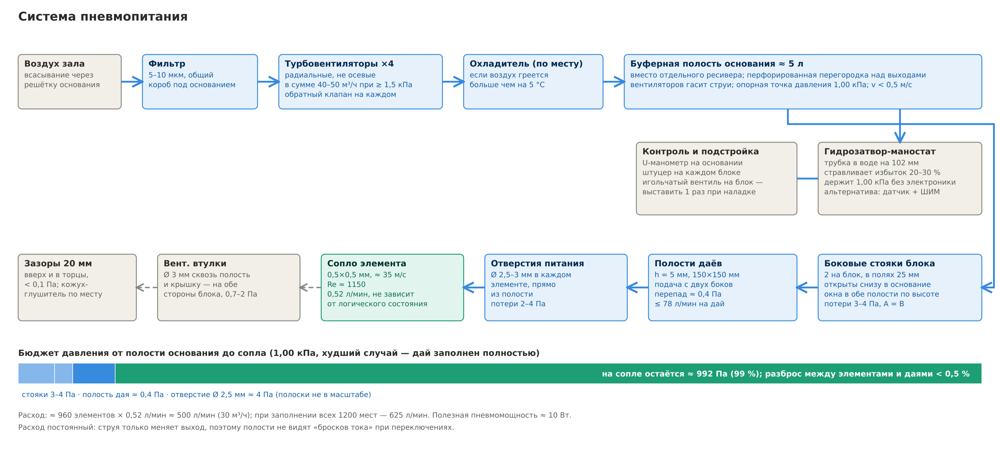

# Питание

Все числа этого раздела считает [`calc/pneumatics.py`](../calc/pneumatics.py) — при изменении размеров достаточно поправить константы в начале скрипта.

## Режим сопла

Сопло 0,5 × 0,5 мм (гидравлический диаметр 0,5 мм), воздух 20 °C, ν = 1,5·10⁻⁵ м²/с, коэффициент расхода 0,85; v = Cd·√(2p/ρ).

| Давление | Скорость струи | Re | Расход на элемент |
|---|---|---|---|
| 0,50 кПа | 24 м/с | 810 | 0,37 л/мин |
| 0,75 кПа | 30 м/с | 1000 | 0,45 л/мин |
| **1,00 кПа** | **35 м/с** | **1150** | **0,52 л/мин** |
| 1,50 кПа | 42 м/с | 1410 | 0,64 л/мин |
| 2,00 кПа | 49 м/с | 1630 | 0,74 л/мин |

Рабочее окно — Re ≈ 800–1200: выше свободная струя теряет ламинарность, ниже прилипание вялое и растёт время переключения. Номинал — **1,0 кПа**. Для сравнения, у СМСТ-2 рабочее давление 0,01–0,02 кгс/см², то есть 1–2 кПа.

Главное свойство для питания: **расход элемента не зависит от его логического состояния** — струя только меняет выход. Полости не видят бросков нагрузки при переключениях, в отличие от шины питания КМОП.

## Расход

| Что питаем | Расход |
|---|---|
| Один дай, 150 мест | 78 л/мин |
| Один блок, 300 мест | 156 л/мин |
| Вся машина, ≈ 950 элементов с буферами | ≈ 500 л/мин (30 м³/ч) |
| Все 1200 мест | 625 л/мин (37,5 м³/ч) |

Полезная пневмомощность ≈ 10 Вт; электрическая мощность вентиляторов с учётом КПД — порядка 40–60 Вт.

## Источник воздуха

- **Турбовентиляторы ×4** под основанием — только радиальные: осевой вентилятор развивает лишь сотню-другую паскалей. Рабочая точка каждого по его характеристике P–Q — около 1,3–1,5 кПа при четверти общего расхода (≈ 150 л/мин), в сумме 40–50 м³/ч с запасом на сброс.
- **Обратный клапан на каждом**, иначе остановившийся вентилятор становится утечкой.
- **Фильтр 5–10 мкм** на общем всасывании. Сетка нужна и на трубочках матрицы: они всасывают воздух зала вместе с пылью.
- **Охлаждение по месту.** При нагреве на 10 °C кинематическая вязкость воздуха растёт примерно на 6 %, и Re при том же давлении падает на столько же. Если воздух греется больше чем на 5 °C — радиатор или несколько метров шланга.

### Вариант: мотор пылесоса

Подходит, но только со сниженными оборотами. Типовой мотор на 1–1,5 кВт даёт 20–30 кПа и 40–50 л/с; на полных оборотах почти весь воздух пришлось бы стравливать. По законам подобия (давление ∝ n², расход ∝ n, мощность ∝ n³) точка 11 л/с при 1,5 кПа получается примерно на **40 % оборотов** и **60–80 Вт** мощности.

- Обороты — фазовым регулятором (коллекторный мотор) или ШИМ; точное давление держит маностат.
- **Только байпасный мотор** с отдельным охлаждением: в проточном рабочий воздух уносит угольную пыль щёток прямо в сопла 0,5 мм. Ещё лучше бесщёточный мотор от аккумуляторного пылесоса.
- Ресурс щёток коллекторного мотора — сотни часов; для выставки это повод держать запасной.

## Буферная полость основания

- Объём ≈ 4–5 л (≈ 265 × 240 × 60–80 мм) гасит пульсации вентиляторов; отдельный ресивер не нужен.
- Скорость в полости меньше 0,5 м/с — это **опорная точка давления** для всей машины.
- **Перфорированная перегородка** над выходами вентиляторов обязательна: струя турбовентилятора несёт динамическое давление в десятки паскалей, и без перегородки ближайшие стояки получат завышенное давление.
- Окна питания в плите — только под боковыми стояками блоков, по краям. Середина плиты свободна для сигнальных каналов, поэтому питание и сигналы не пересекаются.
- **Гидрозатвор-маностат**: трубка из полости, опущенная в воду на **102 мм**. Вентиляторы подают на 20–30 % больше, чем нужно, избыток уходит пузырями, и давление получается ровно 1,00 кПа независимо от сети, нагрева и засорения фильтра. Воду нужно доливать; пузыри в стеклянной банке — часть арт-объекта. Электронная альтернатива — датчик давления и ШИМ вентиляторов.

## Подача в блок: боковые стояки

Через нижнюю кромку блока воздух подавать нельзя: щель вдоль всей кромки перегородила бы сигнальные каналы плиты под блоком. Поэтому воздух поднимается по двум вертикальным стоякам в боковых полях блока (вырезы во всех слоях, ≈ 17 × 35 мм) и входит в обе полости через окна по всей высоте.

| Параметр | Значение |
|---|---|
| Расход на стояк | ≈ 78 л/мин (по половине двух даёв) |
| Скорость в стояке | ≈ 2,2 м/с, динамический напор ≈ 3 Па |
| Потери на входе и неравномерность по высоте | ≈ 4 Па |
| Даи A и B | питаются из одних стояков симметрично |

## Полость дая

Ламинарное течение в щели высотой h с равномерным отбором; вентиляционные втулки занимают часть сечения (+20 % к сопротивлению).

| h | Подача с одного бока | С двух боков (стояки) |
|---|---|---|
| 4 мм | 2,7 Па | 0,7 Па |
| **5 мм** | 1,4 Па | **0,34 Па** |
| 6 мм | 0,8 Па | 0,2 Па |

Перепад растёт как 1/h³, поэтому экономить на высоте полости нельзя. Втулки стоят рядами вдоль строк элементов, а воздух от боковых стояков идёт как раз вдоль строк, по свободным коридорам; заодно втулки держат крышку полости.

## Отверстие питания элемента

Площадь отверстия из полости к соплу должна быть хотя бы в 10 раз больше площади сопла, иначе разброс сверловки превращается в разброс давлений.

| Отверстие, длина 3 мм | Площадь / площадь сопла | Потери |
|---|---|---|
| 1,0 мм | 3× | 129 Па (13 %) |
| 1,5 мм | 7× | 26 Па |
| 2,0 мм | 13× | 8 Па |
| **2,5–3,0 мм** | **20–28×** | **1,6–3,3 Па** |

## Выхлоп

У элемента два вентиляционных окна — по одному сбоку от каждого выхода. Каждое выводится своей втулкой сквозь полость питания и крышку на наружную сторону блока.

Расход между окнами делится несимметрично: через окно у активного выхода уходит почти весь поток струи, а окно у пассивного выхода может даже подсасывать воздух снаружи. Поэтому каждая втулка считается на полный расход элемента.

| Втулка, длина 8 мм | Противодавление |
|---|---|
| Ø 2,5 мм | ≈ 4 Па |
| Ø 3,0 мм | ≈ 2 Па |
| **Ø 3,5 мм** | **≈ 1,1 Па** |
| Ø 4,0 мм | ≈ 0,6 Па |

- Если окна стоят у краёв места элемента, окна соседних элементов в строке оказываются в 3–4 мм друг от друга; втулки там тонкостенные или овальные. Можно вывести окна двух соседей в одну общую втулку — давление в ней около 1 Па, связь между элементами пренебрежима.
- **Симметрия важнее размера**: обе втулки элемента должны иметь одинаковое сопротивление, иначе пороги переключения смещаются в одну сторону.
- В каждый зазор 20 мм между блоками дуют две стороны соседних блоков (≈ 156 л/мин); воздух уходит вверх и в торцы со скоростью ≈ 0,2 м/с, противодавление меньше 0,1 Па. Для шума ряд можно накрыть кожухом с глушителем сверху.

## Бюджет давления

| Участок | Потери |
|---|---|
| Буферная полость основания | < 0,1 Па |
| Боковой стояк | ≈ 4 Па |
| Полость дая, h = 5 мм, подача с двух боков | ≈ 0,3 Па |
| Отверстие Ø 2,5 мм | ≈ 3 Па |
| **На сопле** | **≈ 992 Па из 1000** |

Важно не абсолютное давление, а согласование: выходное давление элемента пропорционально его питанию, и дай с заниженным питанием слабее управляет соседним. Ориентир — **±3–5 % между даями**, расчётный разброс меньше 0,5 %. Расход постоянный, поэтому достаточно один раз при наладке проверить давление на каждом блоке U-манометром и при необходимости поджать дросселем в окне стояка.

## Пуск и останов

- При подаче давления ячейки памяти встают в случайное состояние. Если случайно окажется установлен `run`, машина досчитает умножение до X = 0 и остановится — до ≈ 35 с, кнопки в это время игнорируются. Сброс по включению (пневматическая задержка: объём + дроссель, которая первую секунду держит входы R ячеек состояния) обойдётся в 2–3 элемента; в нетлисте его пока нет.
- Генератор фаз — двухразрядный счётчик Джонсона: все 4 состояния рабочие, после включения он не зависает.
- Вентиляторы включать одновременно; маностат начинает стравливать, когда давление дошло до 1,00 кПа.
